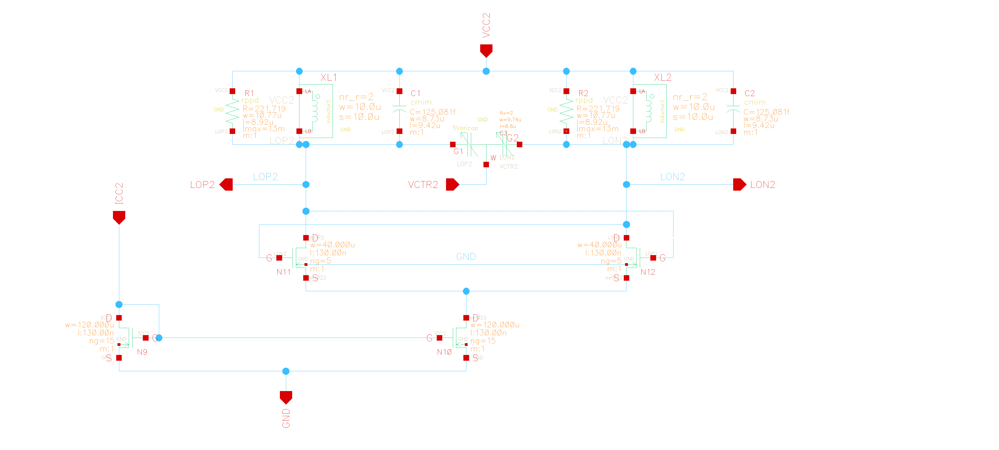

# VCO

The LC-VCO schematic was implemented in the Cadence Virtuoso environment, using the technology available in the SG13G2 folder for room-temperature simulations. To enable operation under cryogenic conditions, transistor characterization was provided by IHP and made available in the SG13G2C folder, allowing for the analysis of device behavior at low temperatures. The schematic and the testbench were implemented according to Figures 1 and 2, respectively.

*Figure 1: LC-VCO schematic.*

*Figure 2: Testbench Setup for the LCVCO.*

## Input and Output of a Cross-Coupled LC VCO:

- LOP2 and LON2-: Differential output pair
- VCC2: Power supply terminal
- ICC2: Bias current terminal
- VCTR2: Control Voltage of the varactor
- GND: Ground terminal

## Parameters

| Parameter               | Value   (300 K)     | Value   (4 K)      |
| ----------------------- | ------------------- | -------------------- |
| Technology              | IHP (SG13G2) 130 nm | IHP (SG13G2C) 130 nm |
| Control Voltage (Vctrl) | 0–3 V               | 0–3 V                |
| Supply Voltage          | 1.5 V               | 1.5 V                | 
| Bias Current            | 6 mA                | 6 mA                 |

